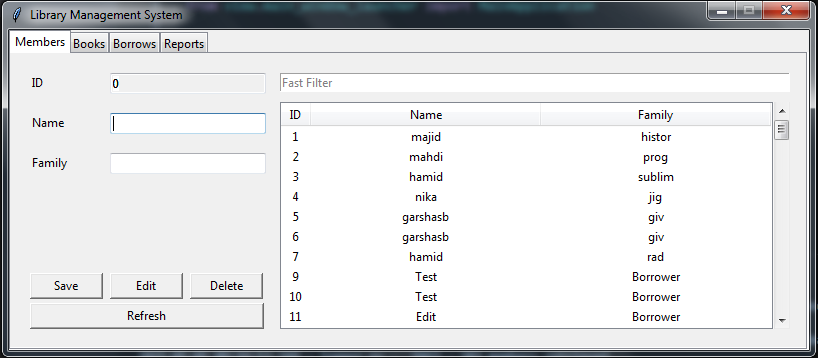
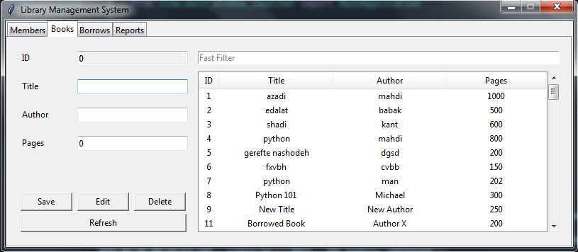
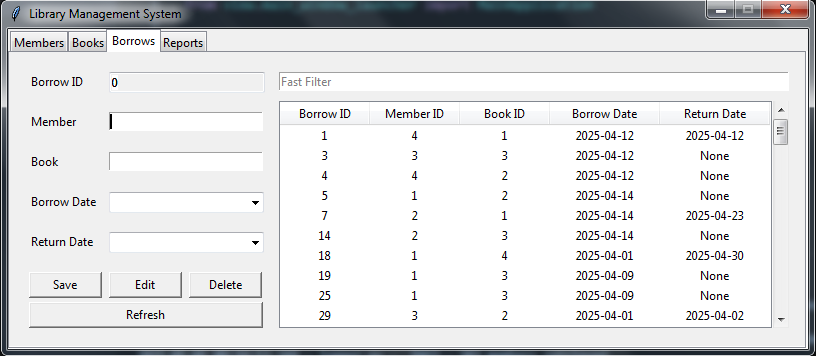
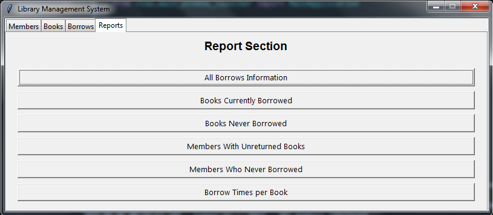
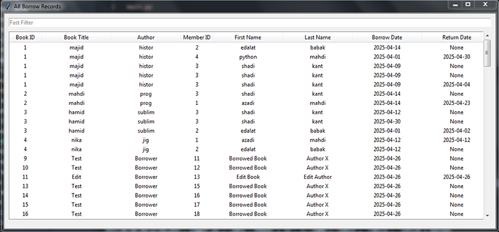

# 📚 Library Management System (Tkinter + MVC + PostgreSQL)


---

A full-featured desktop application to manage books, members, and borrowing transactions, built with Python, Tkinter, and PostgreSQL, following the MVC architecture.

---

## ✨ Features

- 📖 **Manage Books** — Add, edit, delete, and list all books.
- 🧑‍🎓 **Manage Members** — Add, edit, delete, and list all members.
- 📚 **Manage Borrows** — Track borrow and return dates.
- 📈 **Reports**:

  - Books currently borrowed
  - Books never borrowed
  - Members with unreturned books
  - Members who never borrowed
  - Borrow history and borrowing frequency

## 🗀 Demo Screenshots

| Members                     | Books                     | Borrow                      | Reports                    | Sample Reports                |
| --------------------------- | ------------------------- | --------------------------- | -------------------------- | ----------------------------- |
|  |  |  |  |  |

- ## 🐍 **Tech Stack**:
  - Python 3.8+
  - SQLAlchemy ORM
  - PostgreSQL
  - Tkinter GUI
  - Pytest for testing

## 📁 Project Structure

```bash
library-management/
├── controller/              # Business logic (books, members, borrows, reports)
│   ├── book_controller.py   # Book-related actions
│   ├── borrow_controller.py # Borrowing logic
│   ├── member_controller.py # Member management
│   └── report_controller.py # Reporting logic
│
├── model/                  # ORM models and database access
│   ├── entity/             # SQLAlchemy entity classes (Book, Member, Borrow)
│   └── da/                 # Data access logic
│       ├── base_access.py  # Generic DAO class
│       └── session.py      # PostgreSQL session creation
│
├── view/                   # GUI views and components (Tkinter)
│   ├── component/          # Reusable UI widgets (e.g., tables, autocomplete)
│   ├── book_tab_view.py
│   ├── member_tab_view.py
│   ├── borrow_tab_view.py
│   └── report_tab_view.py
│
├── images/                 # Screenshots for README
├── tests/                  # Pytest test modules
├── README.md               # Project overview and contact
├── LICENSE                 # License (CC BY-NC-ND 4.0)
├── requirements.txt        # Python dependencies
└── main.py                 # Application entry point
```

---

## ⚡ Quick Start

1. Install dependencies:

```bash
pip install -r requirements.txt
```

2. Run the application:

```bash
python library-management/main.py
```

---

## 🔗 Requirements

- Python 3.8+
- PostgreSQL (running locally)
- Required Python libraries listed in `requirements.txt`

---

## ✅ Testing

To run unit and integration tests:

pytest tests/

Ensure your database is active and configured before executing tests.

---

## 📝 Database Setup

The database `books_borrow` is automatically created if it doesn't exist.  
Tables are generated using SQLAlchemy's `Base.metadata.create_all()`.

You need to have PostgreSQL server running and accessible and have a database named "postgres" (default).
Update the database connection URL in model/da/config.py accordingly.

---

## 💼 About This Project

This project demonstrates my ability to design, structure, and implement GUI-based business apps from scratch using modern Python practices. You're welcome to explore and run the code for learning or inspiration.

If you want to customize this project or need a similar solution for your use-case, feel free to contact Author.

---

## 👨‍💻 Author

**Mahdi Mahmoodkhani**

Software Developer & Python Enthusiast 🚀

📧 Email: garshasb79@gmail.com

💬 Telegram: @azadibarabarishadi

---

## 📜 License

This project is licensed under the MIT License - see the [LICENSE](./LICENSE) file for details.

